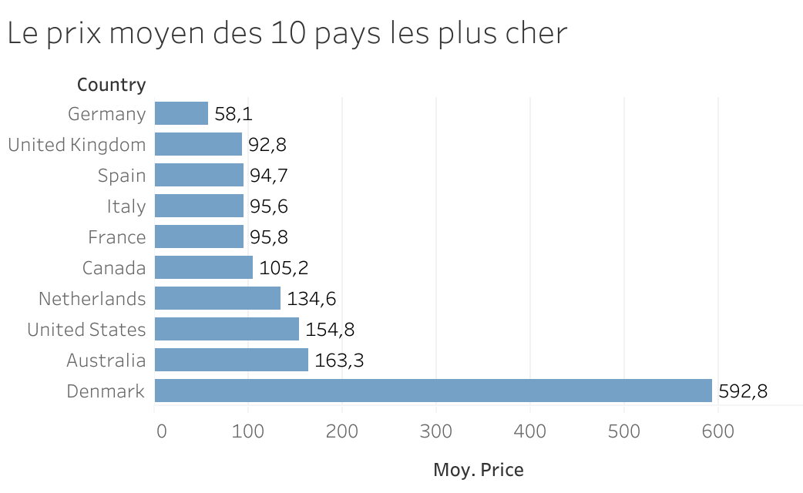

#  Analyse Airbnb - Où investir ?

## Mise en situation 
Je suis data analyst pour un investisseur immobilier.
Il souhaite identifier les pays et villes les plus rentables pour investir dans des logements Airbnb à l’échelle mondiale.

##  Objectif
Analyser les données Airbnb pour identifier les pays et villes les plus rentables afin d'aider à la prise de décision d'investissement.

---

##  Données

Le dataset complet Airbnb 1,94go (https://www.kaggle.com/datasets/joebeachcapital/airbnb) a été utilisé pour réaliser l’analyse.

Pour des raisons de performance et de limite de stockage sur GitHub, une version allégée du dataset (échantillon) a été utilisée dans ce dépôt.

Fichier utilisé ici : `airbnb-listings-simple.csv`

---

##  Outils
- Python
- Pandas
- Matplotlib
- Tableau

---

##  Analyses réalisées

- Calcul du prix moyen global
- Analyse du prix moyen par pays
- Identification des pays avec le plus d’annonces
- Analyse des villes les plus chères
- Analyse du prix selon le type de logement

---

##  Résultats principaux

- Les logements entiers sont les plus chers
- Certaines villes présentent des prix très élevés (ex : Hong Kong)
- Les pays avec beaucoup d’annonces ne sont pas toujours les plus rentables

---

##  Visualisation – 

Prix moyen par pays

On observe que le Danemark a les prix Airbnb les plus élevés.
J’ai vérifié si ce résultat était cohérent en analysant le nombre d’annonces et la distribution des prix.
Le Danemark fait partie des pays avec le plus d’annonces (plus de 20 000), avec des prix allant de 106 € à 995€.
La moyenne est de 592€ et la médiane est de 597€ sont très proches, ce qui montre qu’il n’y a pas de forte influence de valeurs extrêmes.
Ces éléments confirment que le résultat est fiable et suggèrent que le marché Airbnb au Danemark semble se positionner sur un segment plus cher.

Top 10 des pays avec le plus d'offre 

---

##Conclusion

Pour maximiser la rentabilité d’un investissement Airbnb :
- privilégier les villes avec des prix élevés 
- analyser le niveau de concurrence
- choisir le type de logement adapté

---

##Compétences développées

- Nettoyage de données
- Analyse exploratoire (EDA)
- Manipulation avec Pandas
- Visualisation avec Matplotlib
